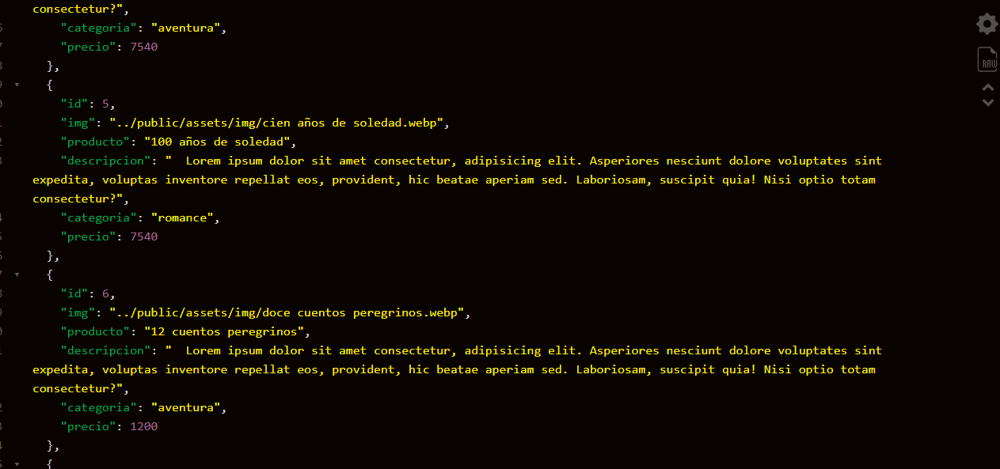

# API REST BOOKS

> esta API REST de libros se desarrollo con el proposito de para practicar con los conociminetos abquiridos en lo largo del tiempo, empezaremos mencionando las tecnologias y dependencias instaladas para su funcionalidad.





## Run Locally

clone el proyecto

```bash
  git clone https://link-to-project
```

ingrese al directorio del proyecto

```bash
  cd my-project
```

instale las dependencias

```bash
  npm install
```

inicie el servidor

```bash
  npm run start
```

```
└── 📁RestApiExpress
    └── .editorconfig
    └── .env
    └── .gitignore
    └── 📁build
        └── 📁app
            └── app.js
            └── config.js
        └── 📁controller
            └── controller.bd.js
        └── 📁database
            └── bd.js
        └── main.js
        └── 📁routes
            └── books.routes.js
        └── 📁services
            └── services.js
    └── 📁client
        └── metodos.http
    └── json.png
    └── package-lock.json
    └── package.json
    └── README.MD
    └── 📁src
        └── 📁app
            └── app.ts
            └── config.ts
        └── 📁controller
            └── controller.bd.ts
        └── 📁database
            └── bd.ts
        └── main.ts
        └── 📁routes
            └── books.routes.ts
        └── 📁services
            └── services.ts
        └── types.d.ts
    └── tsconfig.json
```


## Documentacion

se debe de contar con un entorno de javaScript para poder iteractuar con js desde local, en mi caso utilizo node.js, pero se puede utilizar bun o el de su preferencia.

### inicializar el proyecto

> ejecutar el comando y seguir las instrucciones para la inicializacion del proyecto
```bash
    npm run init
```

> para inicializar todo sin hacer nada utilizar
```bash
    npm run init -y
```

---

### express
> se debe de installar express para el manejo de las rutas y periciones http

```bash
    npm install express
```

> tambien se deben de instalar los tipos de express para que TS lo reconozca, esta dependencia seran de desarrollo

```bash
    npm install @types/express -D
```
---

### mysql
> se debe de installar mysql para iteractuar con la BD en este caso utilice promise-mysql para trabajar de manera asincrona las query's

```bash
    npm install promise-mysql
```

> tambien se deben de instalar los tipos de express para que TS lo reconozca, esta dependencia seran de desarrollo

```bash
    npm install @types/express -D
```
---

### morgan
> se utiliza morgan para ver que tipos de solicitudes recibe el servidor y mas informacion que podria ser de interes, tambien se debe de instalar las dependencias para que TS lo reconozca, estas dos dependencias son de desarrollo.

```bash
    npm install morgan @types/morgan -D
```
---

### dotenv
> se utiliza esta dependencia para poder acceder a las variables de entorno, este nos ayuda a porteger los datos sensibles de nuestra api rest. igualmente se instala como desarrollo

```bash
    npm install dotenv -D
```
---

### TypeScript
> se utilizo TypeScript para desarrollar la api y asi prevenir errores posibles que podrian succeder en produccion. esta es de desarrollo ya que compilaremos el codigo a javaScript

```bash
    npm install TypeScript -D
```
> posteriormente se inicializa TypeScript para asi poder tener el archivo de configuracion y añadir o quitar clausulas mucho mas comodo, en el `package.json` se crea el comando `tsc:tsc` y se ejecuta el comando.

```bash
    npm run tsc -- --init
```
#### post
> se configura el archivo dependiendo el proyecto y sus necesidades, pero validar la ruta de salida `"outDir": "./build"` ya que esta es donde se compilan los archivos de TS.
---

### ts-node-dev
> esta dependencia nos ayuda a compilar el codigo TS a JS cada vez que haya un cambio en un archivo, este es una alterniativa a nodemon pero mejorado

```bash
    npm install ts-node-dev -D
```
> se debe de modificar el package.json con el comando `"nombre-x" : "ts-node-dev ruta_archivo/s.ts"`
---


### ts-standard
> esta dependencia de eslint nos ayuda a tener una consistencia al momento de escribir el codigo, asi todos programamos en un mismo idioma y no hay inconsistencia en el codigo

```bash
    npm install ts-standard -D
```
> se debe de modificar el package.json con el comando `"lint" : "ts-standard"`, este al momento de ejecutarlo detecta los errores del codigo, con el flat --fix `"lint" : "ts-standard --fix"`, corrige los errores automaticamente

> posteriormente tambien se añade esta modificacion al package.json para que renocozca ts-standard

```
"eslintConfig": {
    "parserOptions": {
      "project": "./tsconfig.json"
    },
    "extends": [
      "./node_modules/ts-standard/eslintrc.json"
    ]
  }
```
---


## API REFERENCIA

#### Get all books
```http
  GET /api/books/
```
| Parameter | Type     | Description                |
| :-------- | :------- | :------------------------- |
| `null` | `null` | null |

---

#### Get one book
```http
  GET /api/books/:colum/:value
```
| Parameter | Type     | Description                       |
| :-------- | :------- | :-------------------------------- |
| `colum`      | `string` | Nombre de parametro |
| `value`      | `string` | Valor del parametro buscado |

---

#### POST create book
```http
  POST /api/books/
```
| Parameter | Type     | Description                       |
| :-------- | :------- | :-------------------------------- |
| `null`      | `null` | null|

#### cuerpo de la peticion

```
Content-Type: application/json,
{
  "img": "../public/assets/img/1984.webp",
  "producto": "deporte estremo",
  "descripcion": "Lo sabes que es de lo mas real de la vida",
  "categoria": "ficcion",
  "precio": 47890
}
```
---

#### PUT update book
```http
  PUT api/books/:id
```
| Parameter | Type     | Description                       |
| :-------- | :------- | :-------------------------------- |
| `id`      | `string` | Identificador del libro|

#### cuerpo de la peticion

```
Content-Type: application/json,
{
  "img": "../public/assets/img/1984.webp",
  "producto": "50 sombreas de harry potter",
  "descripcion": "El que sabe de back-end y mas...",
  "categoria": "ficcion",
  "precio": 45000
}
```
---

#### PATCH update book
```http
  PATCH api/books/:id
```
| Parameter | Type     | Description                       |
| :-------- | :------- | :-------------------------------- |
| `id`      | `string` | Identificador del libro|

#### cuerpo de la peticion

```
Content-Type: application/json
{
  "producto": "50 sombreas de harry potter",
  "descripcion": "El que sabe de back-end"
}
```

#### DELETE claer book
```http
  DELETE api/books/:id
```
| Parameter | Type     | Description                       |
| :-------- | :------- | :-------------------------------- |
| `id`      | `string` | Identificador del libro|


## 🔗 Links
[](https://portafolio-dv.netlify.app)
[](https://www.linkedin.com/in/davinson-vanegas/)

[](https://choosealicense.com/licenses/mit/)

